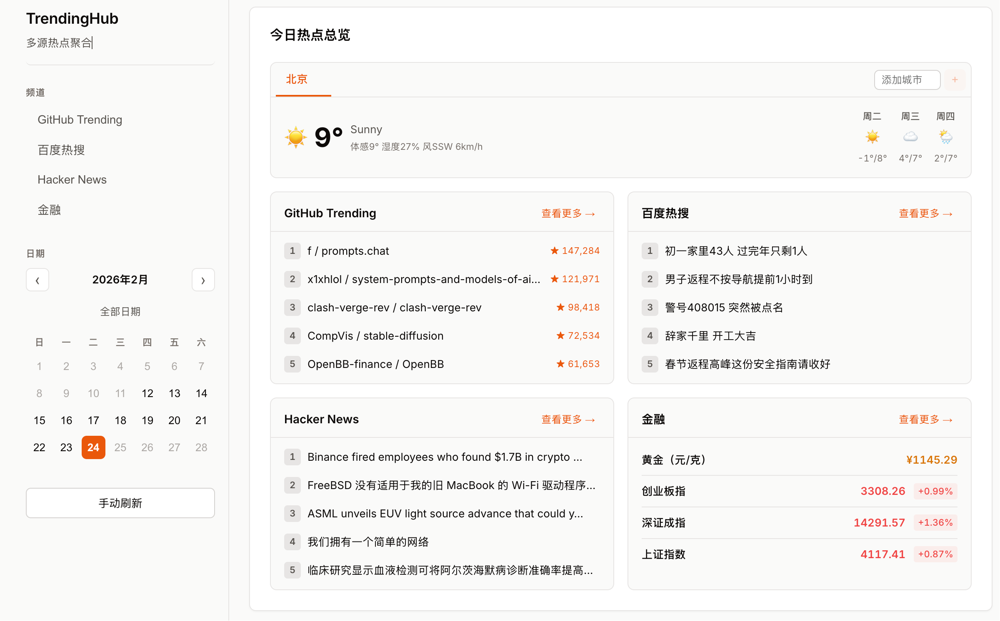

# TrendingHub

多源热点聚合服务 —— 统一抓取 GitHub Trending、百度热搜、Hacker News、金融行情等热门数据，并提供天气预报，通过 Web 界面一站式浏览。



## 功能特性

- **首页仪表板**：总览所有频道的热门内容，一屏掌握全局
- **GitHub Trending**：抓取 GitHub 每日热门仓库，自动翻译非中文描述
- **百度热搜**：实时获取百度热搜榜单
- **Hacker News**：抓取 Hacker News 热门文章
- **金融行情**：黄金价格（元/克）；A 股三大指数（上证、深证、创业板）置顶，其它股票通过环境变量 `ASHARE_STOCK_CODES` 手动配置（逗号分隔 6 位代码，如 `600519,000858,300750`），不展示涨幅榜
- **天气预报**：基于 [QWeather 和风天气](https://dev.qweather.com/)，支持多城市标签页切换，当前天气 + 3 天预报
- **日期筛选**：支持按日期查看历史数据
- **定时采集**：各数据源按独立周期自动更新

## 技术栈

| 层 | 技术 |
|---|---|
| 前端 | React + TypeScript + Vite |
| 后端 | Go + Gin |
| 数据库 | PostgreSQL（GORM） |
| 缓存 | Redis |
| 定时任务 | robfig/cron/v3 |
| 采集 | Colly + 标准 HTTP |

## 目录结构

```
cmd/api/             API 服务入口
internal/
  api/               Gin 路由与 Handler（含天气代理）
  collector/         各数据源采集器
    github_mock.go     GitHub Trending
    baidu_hot.go       百度热搜
    hackernews.go      Hacker News
    gold_chart.go      黄金价格
    ashare_index.go    A 股指数
    translate.go       翻译工具
  config/            配置加载
  processor/         数据清洗与去重
  scheduler/         定时任务调度
  storage/           PostgreSQL + Redis 封装（含天气缓存）
web/                 前端 SPA（React + Vite）
```

## 快速开始

### 1. 启动依赖服务

```bash
docker compose up -d
```

### 2. 启动后端

```bash
cd cmd/api
go run .
```

启动时会自动：
- 初始化数据库表结构
- 添加默认天气城市（北京）并预取天气缓存
- 启动定时采集任务

### 3. 启动前端

```bash
cd web
npm install
npm run dev
```

前端默认运行在 `http://localhost:5173`，通过 Vite 代理访问后端 `http://localhost:9000`。

## 采集周期

| 数据源 | 周期 |
|--------|------|
| 百度热搜 | 每 30 分钟 |
| 黄金价格 | 每 30 分钟 |
| A 股指数 | 每 3 分钟 |
| Hacker News | 每小时 |
| GitHub Trending | 每 2 小时 |
| 天气数据 | 每小时 |

## API 接口

| 方法 | 路径 | 说明 |
|------|------|------|
| GET | `/health` | 健康检查 |
| GET | `/api/v1/news` | 新闻列表（参数：`channel`、`sort`、`limit`、`date`） |
| GET | `/api/v1/news/dates` | 有数据的日期列表 |
| GET | `/api/v1/weather` | 所有关注城市的天气缓存 |
| GET | `/api/v1/weather/cities` | 天气城市列表 |
| POST | `/api/v1/weather/cities` | 添加天气城市（body: `{"city":"城市名"}`) |
| DELETE | `/api/v1/weather/cities/:city` | 移除天气城市 |

示例：

```bash
curl "http://localhost:9000/api/v1/news?channel=github&sort=hot&limit=10"
curl "http://localhost:9000/api/v1/weather"
```

## 注意事项

- GitHub Trending 页面结构可能变化，解析逻辑属于"尽力而为"的实现
- 非中文仓库描述会自动翻译为中文（优先 Google 翻译，失败时回退 MyMemory）
- 天气数据来源于 QWeather 和风天气（需要申请免费开发者 Key，在运行环境中配置 `QWEATHER_API_KEY`、`QWEATHER_API_HOST`，例如使用 `.env` 文件或部署平台的环境变量功能），后端定时缓存确保响应速度
- 若希望为整个站点添加访问密码，可在运行环境中配置 `APP_BASIC_USER` 和 `APP_BASIC_PASS`，启用 HTTP Basic Auth 保护（浏览器会在访问时弹出账号/密码框；`/health` 接口不受影响）
- A 股自选股：设置环境变量 `ASHARE_STOCK_CODES`（逗号分隔，如 `600519,000858,300750`），金融频道会在三大指数下方展示这些股票的行情；不设置则仅展示黄金 + 三大指数
- X 热搜因外部数据源不稳定暂未接入，采集器代码保留在 `internal/collector/x_trends.go`
