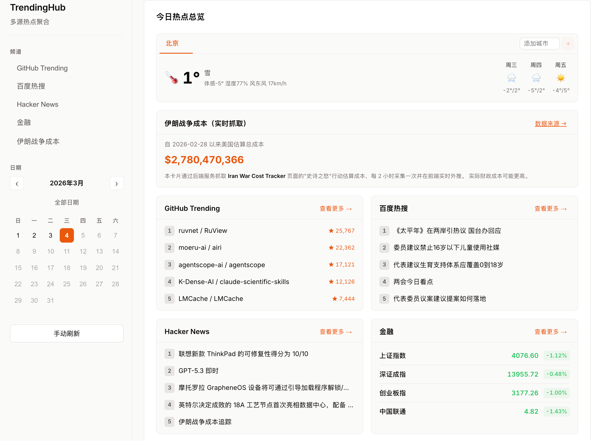

# TrendingHub

多源热点聚合服务 —— 统一抓取 GitHub Trending、Product Hunt、百度热搜、Hacker News、金融行情、伊朗战争实时成本等热门数据，并提供天气预报，通过 Web 界面一站式浏览。



## 功能特性

| 频道 | 说明 |
|------|------|
| **首页仪表板** | 总览所有频道的热门内容、天气卡片、伊朗战争成本滚动条，一屏掌握全局 |
| **GitHub Trending** | 抓取 GitHub 每日热门仓库，非中文描述自动翻译为中文 |
| **Product Hunt** | 独立频道展示 Product Hunt 热门产品，支持关键词搜索与标签筛选；默认展示东八区前一天的数据，且使用公开 RSS，配置 `PRODUCTHUNT_API_TOKEN` 后可优先走官方 GraphQL |
| **百度热搜** | 实时获取百度热搜榜单 |
| **Hacker News** | 抓取 Hacker News 热门文章，标题自动翻译为中文 |
| **金融行情** | 黄金价格走势（元/克）；A 股三大指数（上证、深证、创业板）置顶；自选股通过环境变量 `ASHARE_STOCK_CODES` 配置 |
| **伊朗战争成本** | 独立频道，后端通过 Chromium 无头浏览器抓取 [iran-cost-ticker.com](https://iran-cost-ticker.com/) 实时数据，包含总成本（动态跳动）、每秒/时/日成本、作战阶段、人员伤亡、作战时间线与离散事件成本，事件标题自动翻译为中文 |
| **天气预报** | 基于 [QWeather 和风天气](https://dev.qweather.com/)，支持多城市标签页切换，当前天气 + 3 天预报 |
| **日期筛选** | 支持按日期查看历史数据 |

## 技术栈

| 层 | 技术 |
|---|---|
| 前端 | React 18 + TypeScript + Vite |
| 后端 | Go 1.24 + Gin |
| 数据库 | PostgreSQL 16（GORM） |
| 缓存 | Redis 7 |
| 定时任务 | robfig/cron/v3 |
| 采集 | Colly + chromedp（Headless Chromium）+ 标准 HTTP |
| 翻译 | Google Translate (gtx) → MyMemory 双重回退 |
| 部署 | Docker 多阶段构建（含 Chromium），docker-compose 一键编排 |

## 目录结构

```
cmd/api/                  API 服务入口（main.go）
internal/
  api/                    Gin 路由与 Handler
    router.go               全部路由注册 + 天气代理 + 伊朗战争成本抓取
  collector/              各数据源采集器
    github_mock.go          GitHub Trending
    producthunt.go          Product Hunt
    baidu_hot.go            百度热搜
    hackernews.go           Hacker News
    gold_chart.go           黄金价格
    ashare_index.go         A 股指数
    translate.go            翻译工具（Google gtx → MyMemory）
  config/                 配置加载（环境变量）
  processor/              数据清洗与去重
  scheduler/              定时任务调度
  storage/                PostgreSQL + Redis 封装
    storage.go              Store 初始化与 AutoMigrate
    iran_war.go             伊朗战争成本快照持久化
    weather.go              天气缓存
    ashare_stock.go         A 股自选股
web/                      前端 SPA（React + Vite）
  src/
    App.tsx                 主应用、频道路由
    IranCostTicker.tsx      首页伊朗战争成本滚动条
    IranWarChannel.tsx      伊朗战争成本频道页
    WeatherCard.tsx         天气卡片
    GoldChart.tsx           黄金走势图
    AshareBlock.tsx         A 股指数展示
    AshareStocksManager.tsx 自选股管理
    DayChart.tsx            日线图表
    Calendar.tsx            日期选择器
    api.ts                  API 请求封装
    types.ts                TypeScript 类型定义
    styles.css              全局样式
Dockerfile                多阶段构建（前端 + Go + Alpine + Chromium）
docker-compose.yml        PostgreSQL + Redis + App 编排
Makefile                  本地验证命令
.github/workflows/        CI / Release 工作流
```

## 快速开始

### 1. 环境准备

```bash
cp .env.example .env
# 编辑 .env，填入实际的 QWeather Key 等配置
```

### 2. Docker Compose 一键启动

```bash
docker compose up -d
```

服务默认运行在 `http://localhost:9000`，包含前端 SPA + 后端 API。

启动时会自动：
- 初始化数据库表结构
- 添加默认天气城市（北京）并预取天气缓存
- 启动所有定时采集任务

### 3. 本地开发

后端：

```bash
go run ./cmd/api
```

前端：

```bash
cd web
npm install
npm run dev
```

前端默认运行在 `http://localhost:5173`，通过 Vite 代理访问后端 `http://localhost:9000`。

## 环境变量

| 变量 | 必填 | 默认值 | 说明 |
|------|------|--------|------|
| `APP_PORT` | 否 | `9000` | API 服务端口 |
| `POSTGRES_DSN` | 否 | localhost 本地连接 | PostgreSQL 连接字符串 |
| `REDIS_ADDR` | 否 | `localhost:6380` | Redis 地址 |
| `QWEATHER_API_HOST` | 否 | — | 和风天气 API Host |
| `QWEATHER_API_KEY` | 否 | — | 和风天气 API Key |
| `PRODUCTHUNT_API_TOKEN` | 否 | — | Product Hunt 官方 GraphQL Token；未配置时回退到公开 RSS feed |
| `ASHARE_STOCK_CODES` | 否 | — | A 股自选股代码，逗号分隔（如 `600519,000858`） |
| `APP_BASIC_USER` | 否 | — | 全站 Basic Auth 用户名 |
| `APP_BASIC_PASS` | 否 | — | 全站 Basic Auth 密码 |
| `WEB_ROOT` | 否 | — | 前端静态文件目录（Docker 中为 `/app/web`） |

## 采集周期

| 数据源 | 周期 |
|--------|------|
| 百度热搜 | 每 30 分钟 |
| Product Hunt | 每 30 分钟 |
| 黄金价格 | 每 30 分钟 |
| A 股指数 | 每 3 分钟 |
| Hacker News | 每小时 |
| GitHub Trending | 每 2 小时 |
| 天气数据 | 每小时 |
| 伊朗战争成本 | 每 2 小时（Redis 缓存 2h，前端基于 perSecond 实时外推动画） |

## API 接口

| 方法 | 路径 | 说明 |
|------|------|------|
| GET | `/health` | 健康检查 |
| GET | `/api/v1/news` | 新闻列表（参数：`channel`、`sort`、`limit`、`date`、`q`、`tag`） |
| GET | `/api/v1/news/dates` | 有数据的日期列表 |
| GET | `/api/v1/weather` | 所有关注城市的天气缓存 |
| GET | `/api/v1/weather/cities` | 天气城市列表 |
| POST | `/api/v1/weather/cities` | 添加天气城市（body: `{"city":"城市名"}`) |
| DELETE | `/api/v1/weather/cities/:city` | 移除天气城市 |
| GET | `/api/v1/iran-war-cost` | 伊朗战争实时成本（含时间线、人员伤亡） |

示例：

```bash
curl "http://localhost:9000/api/v1/news?channel=github&sort=hot&limit=10"
curl "http://localhost:9000/api/v1/news?channel=producthunt&sort=hot&limit=10"
curl "http://localhost:9000/api/v1/news?channel=producthunt&q=cursor"
curl "http://localhost:9000/api/v1/weather"
curl "http://localhost:9000/api/v1/iran-war-cost"
```

## 伊朗战争成本频道

后端使用 Chromium 无头浏览器（chromedp）渲染 [iran-cost-ticker.com](https://iran-cost-ticker.com/)，等待 JS 执行完毕后提取：

- **总成本**：自开战以来美国估算总支出
- **每秒/每小时/每日成本**：当前阶段的消耗速率
- **离散事件成本**：作战时间线中的单次军事行动费用
- **作战阶段**：初始打击 → 持续作战 → 制空权/情报侦察监视
- **人员伤亡**：美国 / 伊朗双方军事与平民伤亡数据
- **作战时间线**：各次军事行动事件与估算成本

数据每 2 小时重新抓取一次并缓存至 Redis，同时持久化快照到 PostgreSQL。前端基于 `perSecond` 速率在刷新间隔内实时外推，让总成本数字动态跳动。

时间线事件标题通过项目内置翻译（Google Translate gtx → MyMemory）自动译为中文。

若 Chromium 不可用，自动回退到三阶段日成本模型进行估算。

## 全站访问密码

设置 `APP_BASIC_USER` 和 `APP_BASIC_PASS` 环境变量即可为整站启用 HTTP Basic Auth（`/health` 不受影响）。

```bash
# .env
APP_BASIC_USER=admin
APP_BASIC_PASS=secret
```

## CI / CD

项目提供 GitHub Actions 工作流：

- **CI**（`.github/workflows/ci.yml`）：对 `main` 分支的 push/PR 运行 Go 单元测试 + 前端构建
- **Publish Container**（`.github/workflows/docker-publish.yml`）：构建 `linux/amd64` 和 `linux/arm64` 多架构镜像并推送到容器仓库

需要的 Secrets：

| 名称 | 说明 |
|------|------|
| `CONTAINER_REGISTRY_USERNAME` | 容器仓库用户名 |
| `CONTAINER_REGISTRY_PASSWORD` | 访问凭证 |
| `CONTAINER_REGISTRY_URL`（可选） | 仓库地址，默认 `docker.io` |
| `CONTAINER_REGISTRY_IMAGE`（可选） | 镜像名，默认 `ljtian/trendinghub` |

### 本地验证

```bash
make test           # Go 测试 + 前端构建
make backend-test   # 仅 Go 测试
make frontend-build # 仅前端构建
```

## 注意事项

- GitHub Trending 页面结构可能变化，解析逻辑属于"尽力而为"的实现
- 非中文内容（GitHub 描述、Hacker News 标题、伊朗战争时间线）自动翻译为中文，优先 Google 翻译，失败时回退 MyMemory
- Product Hunt 默认展示东八区前一天数据，并走公开 RSS feed；如果配置了 `PRODUCTHUNT_API_TOKEN`，会优先使用官方 GraphQL 拉取热门产品和 topics
- 天气数据来源于 QWeather 和风天气，需申请免费开发者 Key 并配置 `QWEATHER_API_KEY` 与 `QWEATHER_API_HOST`
- 伊朗战争成本抓取依赖 Chromium，Docker 镜像已内置；本地开发需系统安装 Chrome 或 Chromium
- X 热搜因外部数据源不稳定暂未接入，采集器代码保留在 `internal/collector/x_trends.go`
